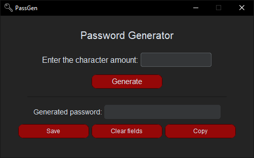

# PassGen 🔒
PassGen is a neat Python GUI for my password generation logic made with CustomTkinter.<br>
It uses the following libraries: CustomTkitner, CTkMessagebox, secrets, string, os and sys.<br>
The [binaries](https://github.com/Guilherme-A-Garcia/PassGen/releases) are currently compiled with [Nuitka](https://nuitka.net/).

## Table of Contents
- [Preview](#preview)
- [Current Features](#current-features)
- [Requirements](#requirements)
- [How to Use](#how-to-use)
- [Using the Source Code](#using-the-source-code)
- [Roadmap](#roadmap)
- [How to Contribute](#how-to-contribute)

## Preview


## Current Features
- Intuitive and modern interface
- ~~-Basic password generation-~~
- Proper password generation with the secrets module
- Password character pool customization
- Password exportation
- Dark/Light theme switch
- Error handling with message boxes
- Binaries for both Windows and Linux

## Requirements
If you wish to use the source code version you will need to install [Python](https://www.python.org/downloads/).🐍<br>

Otherwise, if you're planning on using the binary, you won't need to install any third-party application or interpreter.<br>
If you're a Linux user, don't forget to grant executable permissions to the .AppImage binary with `chmod +x`!

## How to Use
1. Download the latest release of this project (Or download the latest version of the repository);<br>

2. Execute the .exe binary (or the .AppImage binary if you're on Linux);<br>

3. Input the amount of characters your password will have;<br>

4. Click "Enter" to generate the password.<br>

If you wish to clear, copy or export the generated password into a .txt file, click the respective button.

## Using the Source Code

1.  **Clone the repository:**
    ```bash
    git clone https://github.com/Guilherme-A-Garcia/PassGen.git
    cd PassGen
    ```

2.  **Create and activate a virtual environment** (recommended):

    *   **Linux/macOS:**
        ```bash
        python3 -m venv venv
        source venv/bin/activate
        ```
    *   **Windows:**
        ```bash
        python -m venv venv
        .\venv\Scripts\activate
        ```

3.  **Install the required packages** using the `requirements.txt` file:
    ```bash
    pip install -r requirements.txt
    ```

4. **Run main.py within the project's directory:**
   ```bash
   python main.py
   ```

## Roadmap
- - [X] Refactor from procedural to OOP;
- - [X] Migrate to CustomTkinter;
- - [x] Themes;
- - [x] Proper Linux support;
- - [x] Introduce advanced character pool customization;
- - [ ] The main dish: Add cryptography to the mix!
- - [ ] Turn this whole thing into PySide6.

## How to Contribute
✨ Contributions are always welcome! ✨<br><br>

-   **Report Bugs**: Open an issue with detailed steps to reproduce.
-   **Suggest Features**: Open an issue to discuss your idea.
-   **Contribute Directly to the Code**:<br>
    I. Fork the repository;<br>
    II. Create a new branch;<br>
    III. Make your changes and commit;<br>
    IV. Push to the branch;<br>
    V. Open a Pull Request;<br>
    VI. Kindly wait for approval. ;)<br>
<br>
Thank you for reading!
